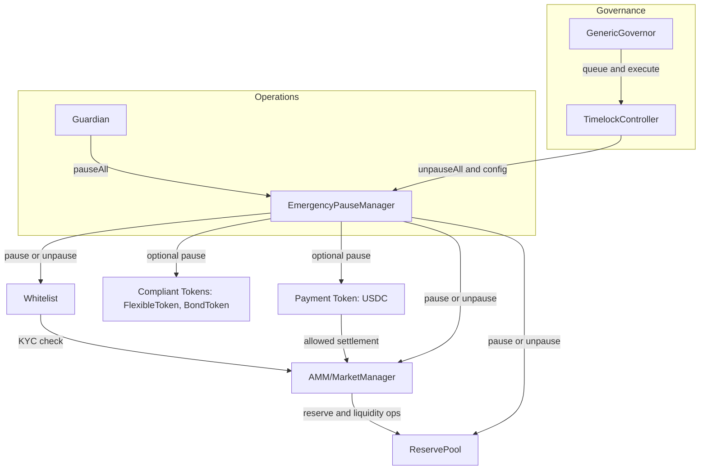

# Compliant Market (Reference)

This reference demonstrates a minimal **compliant token market** with:
- `Whitelist` for KYC gating
- `MarketManager` for trading orchestration + fees
- `ReservePool` for reserve / liquidity / AMM-like logic
- `EmergencyPauseManager` to pause multiple contracts at once
- Governance boundary notes (Timelock/Governor) for recovery & config updates

## Architecture Overview

The diagram below shows the high-level architecture and dependency relationships
for the compliant market reference.

It highlights:
- how compliance is enforced via `Whitelist`
- how emergency pause propagates across contracts
- how governance and timelock control recovery and configuration



**Notes**
- Emergency actions (`pauseAll`) can be executed immediately by the Guardian.
- Recovery actions (`unpauseAll`, configuration changes) must go through governance
  via the Timelock.
- `AMM / MarketManager` is the central enforcement point for compliance and settlement.

## Run

```bash
# 1) Configure env
cp .env.example .env

# 2) Deploy
npm run ex:compliant:deploy

# 3) Wire roles and dependencies
npm run ex:compliant:wire

# 4) Demonstrate flows (pause/unpause outline)
npm run ex:compliant:flows
```

## Output
- addresses: `artifacts/compliant-market.addresses.json`
- roles snapshot: `artifacts/compliant-market.roles.json`

## Notes
- These scripts are intended for testnets first.
- Replace placeholder router/strategy addresses with your actual deployment.
